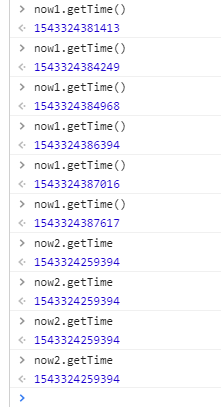

# Vue
### Computed Properties & Methods

In the most cases, their performances are the same. However, in some instances just like:

```vue
computed: {
	now: function(){
		return Date.now();
	}
};
```


The value of 'now' wouldn't update. Because **computed properties are cached based on their dependencies**. A computed property will only re-evaluate when some of its dependencies have changed. 

In comparison, a method invocation will **always** run the function whenever a re-render happens.



So only if we have an expensive property to calculate, we use **Computed Properties** to cache it in case of calculating it again. Otherwise, we should use **methods**.

